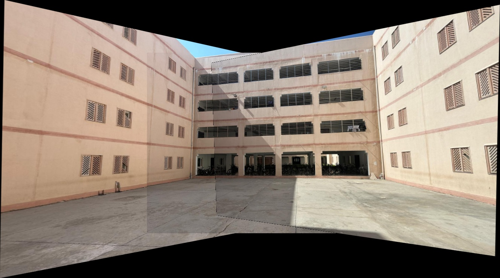
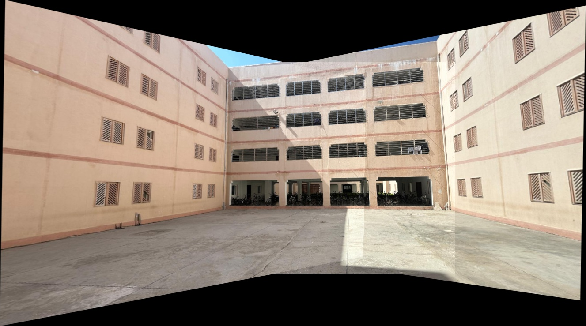

# Panorama Stitching using SIFT

This project implements an image stitching pipeline that combines three overlapping images into a single panoramic image using classical computer vision techniques.

## Approach

- SIFT feature detection
- Feature matching with Lowe’s Ratio Test
- Homography estimation using RANSAC
- Perspective warping
- Naive overlay and blended panorama generation

## Results

### Naive Stitch

### Final Panorama

